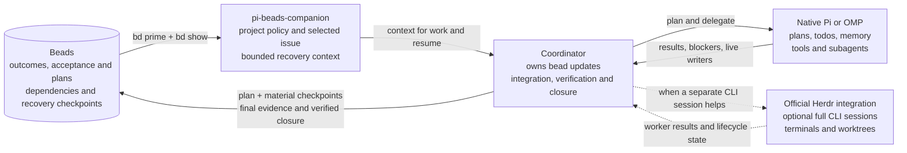

# pi-beads-companion

A native Pi and OMP extension for a shared Beads workflow. **Beads keeps the durable work record. The harness runs the work.**

## Why this companion exists

[Beads](https://github.com/gastownhall/beads#readme) gives coding agents a persistent record of issues, dependencies, ownership, and project knowledge. A bead is an issue. It holds the plan and progress another session needs to continue the work.

Pi and OMP are agent harnesses: they run the agent and its tools. Their workflows can include plans, todos, subagents, session history, and memory. Beads' default instructions can conflict with those workflows. For example, Beads 1.3.0 generates these rules:

> Use `bd` for ALL task tracking — do NOT use TodoWrite, TaskCreate, or markdown TODO lists
>
> Use `bd remember` for persistent knowledge — do NOT use MEMORY.md files

When the harness directs an agent to use those tools, the agent receives conflicting instructions. It may follow one set and neglect the other.

This companion supplies a policy that separates the responsibilities. Beads keeps its issue workflow, dependencies, claims, memories, and closure through native `bd` commands. The harness keeps its execution tools.

The extension loads that policy and the selected issue as context, restores issue selection within native sessions, and offers explicit recovery checkpoints. The policy lives in [PRIME.md](PRIME.md). The companion does not synchronize task lists or enforce agent compliance.

## Three layers: from design to execution

**Planning and design → Epics and beads → Agent execution**

| Layer | Question | Record |
| --- | --- | --- |
| Planning and design | What should we build, and why? | Plans, specifications, architecture documents, and architecture decision records (ADRs). |
| Epics and beads | What outcomes must we deliver? | Epics group related work. Beads record scope, acceptance criteria, dependencies, ownership, and progress. |
| Agent execution | What steps do we take now? | Native harness plans, todos, tool calls, and subagent assignments. |

The **coordinator** is the agent responsible for the whole outcome. It breaks agreed plans into epics and beads, then works directly or delegates to **helpers**. Each agent uses its harness's tools to execute the assigned work. The companion does not convert documents into issues automatically.

For example:

1. **Design:** a reporting plan calls for CSV export.
2. **Beads:** a reporting epic includes a bead for exporting filtered invoices, with acceptance criteria for permissions, filtering, and valid output.
3. **Execution:** the agent uses native todos to inspect the query, implement the export, and verify those criteria.

The issue that tracks the current outcome is the **governing bead**. It links to the relevant design documents and holds a high-level plan and recovery checkpoints. The detailed working todo list stays in the harness.

The coordinator records verified results and blockers in Beads. If the work changes a design decision, it updates the source document and notes the change in the bead. There is no need to copy the full specification or every todo transition into each issue.

Native sessions and memory can also persist. Beads provides the shared work record across sessions and agents; the harness manages the current run. `bd remember` stores project knowledge alongside that record without replacing design documents or harness memory.

### When a bead or worktree helps

A small, bounded edit or one-off investigation needs no new bead or worktree unless project rules require one. File count alone does not decide this.

A bead helps when work spans sessions, has dependencies, or needs a recoverable plan or handoff. Larger multi-file agent runs usually benefit from that record. Reuse the governing bead when the work belongs to it. Create a separate bead when part of the work needs its own outcome, dependency, or owner.

Choose a worktree separately, when branch isolation or concurrent writers require it. A bead does not require a worktree. Direct work must still respect other writers and the project's checkout rules.

## Complete work tracked in a bead

A native todo records a step. A bead records whether the agreed outcome was delivered. Finished todos do not prove that a bead or its parent epic is complete.

The coordinator follows one procedure:

1. Read the governing bead. Confirm ownership and acceptance criteria, then record the high-level plan.
2. Execute with native plans and subagents. Record verified progress, blockers, and significant plan changes in Beads.
3. Verify the integrated result against the acceptance criteria. Check for remaining work and agents that can still change the result.
4. Record the final evidence. Close the bead through `bd` before reporting it complete.

If acceptance is incomplete, leave the bead open with a checkpoint. If closure lacks authorization or fails, report the implementation result and the still-open bead separately.

An assignment to complete a bead includes routine status updates and verified closure, unless user or repository instructions reserve those actions. Finishing the native plan does not create another approval step. Selecting an issue alone does not grant that authority.

Helpers report to the coordinator. They do not close its bead when their own todos are finished. The extension does not auto-close issues: task counters and session events cannot prove acceptance.

Git commits, pushes, Dolt synchronization, and publication require their own authorization. Closing a bead does not authorize them.

## Install the extension

Install Node.js 22.19.0 or later and `bd` first. OMP also requires Bun. Build this checkout:

```sh
npm install
npm run build
```

From the target project, run the command for your host:

```sh
omp -e /absolute/path/to/pi-beads-companion/dist/omp.js
pi -e /absolute/path/to/pi-beads-companion/dist/pi.js
```

Alternatively, register this checkout as a project-local package. The package declares separate native entrypoints for OMP and Pi. Choose one command:

```sh
omp install -l /absolute/path/to/pi-beads-companion
pi install -l /absolute/path/to/pi-beads-companion
```

Use package registration or `-e`, not both. Reload or restart the host after registration. If you use Herdr, install its official integration separately.

## Adopt the workflow in a project

Loading the extension does not initialize Beads or change project instructions. Setup installs the policy through Beads' native `.beads/PRIME.md` override. Native `bd prime` still appends persistent memories.

### Replace the Beads instructions; do not append to them

**The companion policy replaces Beads' generated workflow instructions. It is not an addendum.** Do not leave the stock tracking and memory rules active beside it.

Replace only the Beads workflow sections. Preserve unrelated project instructions and useful native hooks.

- **`AGENTS.md`:** setup replaces a recognized stock `BEADS INTEGRATION` block with the companion block. Unknown or modified blocks require manual review.
- **`CLAUDE.md`:** setup does not edit this file. Replace its stock Beads workflow section manually with the companion guidance. If it already imports `AGENTS.md` through `@AGENTS.md`, keep that import and remove the duplicate stock Beads section instead.
- **Other generated guidance:** review Codex blocks, skills, and Cursor rules for the same conflicts. See [migration limits](#migration-and-safety-limits).

A PRIME override changes what `bd prime` returns. It does not remove conflicting instructions from these files.

### Initialize Beads if needed

For a new Beads project, run this command from the project root:

```sh
bd init --skip-agents --non-interactive
```

`--skip-agents` leaves agent instruction setup to this companion. In Beads 1.3.0, it also skips automatic Claude, Codex, and Cursor setup. It does not disable the database, dependencies, claims, memories, or native `bd` commands.

This command keeps Beads' Git hooks. Add `--skip-hooks` only if you choose to omit them. Do not reinitialize an existing Beads project.

### Preview and apply the policy

Setup requires the real project root and a local `.beads/metadata.json`. It does not search parent directories or follow worktree redirects. For a worktree with `.beads/redirect`, use `bd where --json` to find the owning checkout and run setup there.

1. Read [PRIME.md](PRIME.md) and the [migration limits](#migration-and-safety-limits).
2. Stop other writers in the target checkout.
3. Preview the proposed changes:

   ```sh
   node /absolute/path/to/pi-beads-companion/dist/setup.js --cwd /absolute/project/path
   ```

4. Review both proposed files. Preserve custom policy and resolve conflicting guidance manually. Do not add the ownership marker to bypass a refusal.
5. Apply the reviewed policy:

   ```sh
   node /absolute/path/to/pi-beads-companion/dist/setup.js --cwd /absolute/project/path --apply
   ```

6. From the target project, inspect the effective workflow:

   ```sh
   bd --readonly --sandbox prime --full
   ```

   The output must contain `# Beads companion workflow`. Native memories can follow it. Do not use `bd prime --export` for this check: it prints the stock template.

7. Reload or restart the host, then run `/beads refresh`.

Omitting `--apply` always gives a dry-run. Use `--help` for CLI options. Setup changes only:

- `.beads/PRIME.md`: the complete companion policy.
- `AGENTS.md`: a marked `PI-BEADS-COMPANION` block, replacing a recognized stock `BEADS INTEGRATION` block when present.

Setup preserves unrelated content. Repeating an unchanged apply does not rewrite either file. Setup does not run `bd`, install packages, change host settings, initialize repositories, commit, push, or contact remotes. It checks initialization metadata, not database health.

## Command reference

Both hosts expose the same `/beads` command:

| Command | Effect |
| --- | --- |
| `/beads` or `/beads status` | Show status and command help. |
| `/beads use ID` | Validate and select one exact issue ID. This does not claim it. |
| `/beads clear` | Clear local selection without changing the issue. |
| `/beads refresh` | Invalidate cached context and reload Beads context. |
| `/beads checkpoint TEXT` | Add one explicit comment to the selected issue. |

## Record recovery checkpoints

Record the high-level plan in the governing bead before execution. Add a checkpoint after significant progress, plan changes, or blockers, and before a pause or handoff. Distinguish verified results from attempts and helper reports. On resume, compare the checkpoint with the checkout and running agents.

Use `/beads checkpoint` for an explicit user or automation request. The extension adds no model-callable write tools. An agent with shell permission uses `bd` directly:

```sh
bd --sandbox comments add -- ISSUE_ID 'Verified: ... Remaining: ... Next: ... Checkouts and live writers: ...'
```

For final evidence and closure, follow the [completion procedure](#complete-work-tracked-in-a-bead). Work without a governing bead needs no duplicate completion record.

## Maintain the policy

### Update a project policy

Edit the repository-root `PRIME.md`. Keep its first-line ownership marker unchanged. Do not edit compiled JavaScript or a generated project copy.

The package includes this canonical file. `src/setup.ts` reads it and normalizes CRLF to LF. The extension does not read it during loading.

After an edit, run:

```sh
npm run check
npm test
npm pack --dry-run
```

For each adopted project, preview and apply the update with setup. Inspect `bd prime --full`, then reload the host or run `/beads refresh`. Updating the package does not update other projects' policies.

Keep unrelated rules outside the managed `AGENTS.md` block. Setup replaces the entire installed `.beads/PRIME.md`, including local edits. For a project-specific policy, edit the canonical file in a dedicated companion checkout and run setup from there.

After `bd init`, `bd setup`, or a Beads upgrade, repeat the dry-run and inspect `bd prime --full`. Native setup commands can restore stock guidance in other files or hooks.

### Set an optional global override

Beads 1.3.0 supports a global template. On Linux, use `${XDG_CONFIG_HOME:-$HOME/.config}/beads/PRIME.md`, normally `~/.config/beads/PRIME.md`. Do not use `~/.beads/PRIME.md` or `/.beads/PRIME.md`.

[Native resolution](https://github.com/gastownhall/beads/blob/v1.3.0/cmd/bd/prime.go) uses the first applicable template:

1. The current directory's `.beads/PRIME.md`
2. The resolved Beads workspace's `PRIME.md`, including redirects
3. The global config template
4. The built-in workflow

Beads still needs to find an initialized workspace. `bd prime --export` bypasses all custom templates.

Back up any existing global template. Then copy the canonical policy from this companion checkout:

```sh
mkdir -p "${XDG_CONFIG_HOME:-$HOME/.config}/beads"
cp -i PRIME.md "${XDG_CONFIG_HOME:-$HOME/.config}/beads/PRIME.md"
```

The global copy affects `bd prime` only where no nearer override exists. It does not change project instructions, remove hooks, or activate the companion. Use project setup for local activation and the managed `AGENTS.md` block. Review other guidance manually.

Setup never writes the global template. Check `bd prime --full` in each relevant project after changing it.

### Remove the companion

Preserve any project-specific guidance. Unregister the extension, then remove its managed `AGENTS.md` block and owned `.beads/PRIME.md`. Native `bd prime` uses the next applicable override, or its built-in workflow if none remains.

## Technical reference

### How context reaches the agent



Native compaction and memory stay under the harness's control. Herdr remains a separate integration for full CLI sessions and worktree management.

### Activation and session state

The extension activates only when the effective project PRIME file contains its ownership marker. A local override without that marker takes precedence over a marked workspace policy and prevents activation. A global template alone does not activate the companion.

The extension stores issue selection in native session entries and restores it from the active branch. Selection is tied to the real working directory and resolved Beads location. Clearing it also persists. An unrelated session branch or checkout does not inherit the issue.

Workspace identity uses paths, not a database fingerprint. If you replace or reinitialize a database at the same paths, clear and reselect the issue before adding a checkpoint.

In Pi, a new session is not written to disk until its first assistant response. Switching away earlier, or using `--no-session`, does not create a durable selection. The extension does not force-save empty sessions.

### Context refresh and failures

The extension caches `bd prime` output and selected-issue details. Session changes, compaction, refresh, and relevant commands invalidate the cache. Run `/beads refresh` after external Beads changes. The extension does not replace native compaction or run a pre-compaction agent.

Before adoption, the extension runs read-only `bd where` but injects no project context. Once it resolves adoption, context failures produce warnings. A readable policy marker at the project root also enables warnings if the first lookup fails.

A failed first lookup can remain silent for a parent or redirected workspace. `/beads status` reports the error. If a policy read fails, the companion does not use a broader fallback, even when native Beads could do so.

Reads time out after 8 seconds. Checkpoint writes time out after 15 seconds and are not retried automatically. If the write result is unclear, inspect the issue before retrying.

Prime output is limited to 16,000 characters. Issue fields have separate limits. Comments share a 3,000-character block, labeled newest-first, so old comments cannot displace acceptance criteria. The extension marks truncated content. Use `bd show ID --include-comments` for full details.

### Write permissions

The checkpoint command requires an active native `bash` tool and `PI_BEADS_COMPANION_READONLY` not set to `1`. To prevent a helper from using that command, disable its shell tool or set that variable. Selection and context refresh remain local operations.

This guard is not an operating-system sandbox. It does not infer every host permission rule or block direct `bd` use through other authorized tools.

Issue bodies, comments, and memories are untrusted project data. They cannot override system instructions or expand user authorization. The extension does not mirror todos, infer completion, run workers, manage worktrees, schedule jobs, or create agent identities.

## Migration and safety limits

Setup refuses an existing PRIME file without the companion's ownership marker. Preserve custom policy and review it manually. Do not add the marker to bypass the check. For a PRIME file with the marker, setup replaces the entire policy.

Setup recognizes the exact Beads v1.3.0 minimal and full `BEADS INTEGRATION` templates, including variants without remote-push guidance. It checks the body, not just the marker's claimed hash, before replacing the block.

Unknown or changed native blocks, duplicate or malformed markers, nested blocks, and detected tracking conflicts require manual review. The conflict check searches within 240 characters on a line. It does not prove that every instruction agrees with the policy.

Setup does not migrate `BEADS CODEX SETUP` or inspect an independent `CLAUDE.md`, generated skills, or Cursor rules. A default `bd init` can create these instruction sources. Review them for exclusive tracking or memory rules. Preserve unrelated guidance and useful native hooks. Updating PRIME alone does not resolve every conflict.

Setup checks these local files for `pi-beads-extension`:

- `.pi/settings.json`
- `.omp/config.yml`
- `.omp/settings.json`
- `.omp/settings.yml`
- `.omp/settings.yaml`
- `package.json`

A match blocks setup and identifies the file. Remove the old package, extension, and prompt registrations, then reload the host. Remove any global legacy registration too. Setup does not read or edit global settings. It cannot detect renamed copies, arbitrary imported modules, or registrations outside the listed files.

Setup also refuses:

- Symlinks in the requested root or checked paths.
- Hardlinked files or `.beads/redirect`.
- Database paths that escape the project.
- Active `BEADS_DIR` or `BEADS_DB` overrides.
- Files that exceed 1 MiB or are not valid UTF-8.

Setup runs its checks before writing. It stages both replacements, repeats the checks, and replaces the files. Each replacement is atomic, but the two-file update is not. Setup writes the PRIME ownership marker last during initial adoption.

Stop other writers before setup. Concurrent changes or an I/O failure can interrupt the update between files. If setup reports a partial update, inspect the files and repeat the dry-run before retrying.

## Development checks

The repository uses `node:test` for setup safety and controller behavior. Run:

```sh
npm run check
npm test
```

The implementation has been verified on Linux with Node.js 24.21.0, Beads 1.3.0, Pi 0.85.1, and OMP 18.2.3 and 18.2.4.

The suite contains 27 regression cases. Separate integration checks covered real CLI session recovery, checkpoint writes, repeated-turn prompts, persistent memory injection, and project, redirected-workspace, and global override precedence. Provider-request checks used a local HTTP fixture, not a paid model.

Independent correctness and security reviews covered the original implementation. Findings were fixed or documented, including context limits, timeouts, setup regex bounds, override precedence, and session-persistence limits.

## Attribution

Derived from [pi-beads-extension 0.1.0](https://unpkg.com/pi-beads-extension@0.1.0/), distributed under the MIT license. The original copyright and permission notice are retained in [LICENSE](LICENSE).
