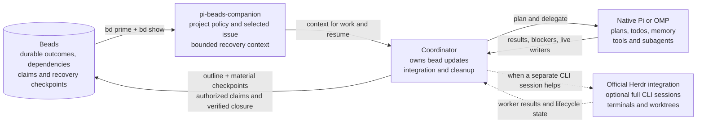

# pi-beads-companion

A native Pi and OMP extension for Beads workflow context, issue selection, and explicit recovery checkpoints. Beads owns durable outcomes, dependencies, claims, and recovery checkpoints. Native host plans, todos, memory, and subagents remain responsible for execution.

## Our view: Beads and the harness coexist

[Beads' workflow diagram](https://github.com/gastownhall/beads#readme) follows work from creation through dependencies, claim, and closure. We keep that durable workflow and give live execution to the agent's native harness. User authority applies throughout.



The coordinator checkpoints meaningful progress in Beads instead of copying every todo transition. Helpers report to the coordinator. Native compaction and memory stay under the harness's control. Herdr remains a separate integration, not a worker manager hidden inside this package.

The full replacement workflow is [PRIME.md](PRIME.md). It is the canonical policy shipped in the package and copied by setup, not a second hand-maintained example.

| Conflicting or inherited guidance | This companion's policy |
| --- | --- |
| Put every task or todo in Beads; prohibit native planning tools. | Beads records durable outcomes. Native plans and todos drive execution. |
| Prohibit native memory because Beads has `bd remember`. | Beads project memory and native harness memory can coexist without duplicate injection. |
| Let every helper claim or close the governing bead. | One coordinator owns updates unless ownership transfers explicitly. |
| Treat session completion as permission to commit, push, sync, or close work. | Each action needs its own authority. Closure also needs verification. |
| Add another compaction agent or Herdr worker protocol. | Use native compaction and the official Herdr integration. |

These are the policy choices of this companion. They do not claim that every Beads version or profile imposes every conflicting rule above.

## Local installation

Node.js 22.19.0 or later and an existing `bd` installation are required. OMP also requires its native Bun runtime. Build this checkout explicitly:

```sh
npm install
npm run build
```

From the project where you want the extension, choose the native entrypoint for your host:

```sh
omp -e /absolute/path/to/pi-beads-companion/dist/omp.js
pi -e /absolute/path/to/pi-beads-companion/dist/pi.js
```

The package root declares `omp.extensions` and `pi.extensions` separately. A project-local package installation uses the same checkout, not the other host's entrypoint:

```sh
omp install -l /absolute/path/to/pi-beads-companion
pi install -l /absolute/path/to/pi-beads-companion
```

Use either package installation or `-e`, not both. Reload or restart the host after registration. Keep the official Herdr integration installed separately. This package neither installs nor replaces it.

## Explicit project adoption

Loading the extension does not initialize or adopt a project. If Beads is not initialized, run this command yourself from the project root:

```sh
bd init --skip-agents --skip-hooks --non-interactive
```

Setup requires the canonical project root with a local `.beads/metadata.json`. It does not search parent directories or follow worktree redirects. Preview the complete proposed policy files before applying them:

```sh
node /absolute/path/to/pi-beads-companion/dist/setup.js --cwd /absolute/project/path
node /absolute/path/to/pi-beads-companion/dist/setup.js --cwd /absolute/project/path --apply
```

`--help` describes the CLI. Omitting `--apply` is always a dry-run. Setup changes `.beads/PRIME.md` and a bounded `PI-BEADS-COMPANION` block in root `AGENTS.md`, and removes a recognized stock `BEADS INTEGRATION` block. It preserves unrelated bytes. Repeating an unchanged apply does not rewrite either file.

Setup does not run `bd`, install packages, change host settings, initialize repositories, commit, push, or contact remotes. The setup check recognizes initialization metadata, not database health. The extension activates only when the effective clone-local or resolved-workspace PRIME file contains its ownership marker. An unowned clone-local override takes precedence and prevents activation.

The companion fails closed on policy read errors rather than adopting a broader fallback, even when native Beads could use that fallback. Use `/beads status` to inspect the error.

### Override the stock Beads workflow

Beads 1.3.0 natively reads `.beads/PRIME.md` in the local clone or resolved workspace instead of its built-in workflow text. Persistent memories still follow that text. No Beads binary patch or global configuration change is needed.

1. Read the bundled [PRIME.md](PRIME.md).
2. Stop other writers in the target checkout.
3. Run the setup dry-run shown above. Review both proposed files.
4. If setup reports a custom PRIME file or unknown guidance, preserve it and reconcile the policy manually. Do not add the ownership marker merely to bypass the refusal.
5. Remove duplicate legacy Beads extension registrations and conflicting inherited guidance. Setup checks only the documented local files.
6. Run setup with `--apply`. It installs the canonical policy and replaces recognized stock `BEADS INTEGRATION` guidance in `AGENTS.md`.
7. From the target project, inspect the effective workflow:

   ```sh
   bd --readonly --sandbox prime --full
   ```

8. Restart or reload the host, then run `/beads refresh`.

The output must contain `# Beads companion workflow`. Native memories can appear after the policy. `bd prime --export` deliberately ignores the override and prints the stock template, so do not use it to check whether the override is active.

Setup targets the owning checkout. For a worktree with `.beads/redirect`, inspect `bd where --json` and run setup in the owning checkout rather than copying policy into an unrelated directory. Reconcile any local PRIME override separately.

### Optional global native override

Beads 1.3.0 also supports a global template. On Linux it is `${XDG_CONFIG_HOME:-$HOME/.config}/beads/PRIME.md`, normally `~/.config/beads/PRIME.md`. It is not `~/.beads/PRIME.md` or `/.beads/PRIME.md`.

[Native resolution](https://github.com/gastownhall/beads/blob/v1.3.0/cmd/bd/prime.go) uses this precedence:

1. The current directory's `.beads/PRIME.md`
2. The resolved Beads workspace's `PRIME.md`, including redirects
3. The global config template
4. The built-in workflow

A discoverable Beads workspace is still required. A project override wins over the global template. `bd prime --export` bypasses all custom templates.

To opt into a global default, back up any existing global template first. Then, from this companion checkout, copy the canonical policy explicitly:

```sh
mkdir -p "${XDG_CONFIG_HOME:-$HOME/.config}/beads"
cp -i PRIME.md "${XDG_CONFIG_HOME:-$HOME/.config}/beads/PRIME.md"
```

This manual copy affects native `bd prime` in Beads projects without a nearer override. It does not reconcile their `AGENTS.md`, remove old hooks, or adopt those projects into the companion. Run project setup for those changes. Setup never writes the global template. After changing it, verify the output from each relevant project rather than assuming the global file wins.

### Update the policy

Edit the repository-root `PRIME.md`, not compiled JavaScript or a generated project copy. Keep the first-line ownership marker unchanged. `src/setup.ts` reads this file directly and normalizes CRLF to LF. The package includes the file; extension loading does not read it.

After an edit, run:

```sh
npm run check
npm test
npm pack --dry-run
```

For each adopted project, repeat the setup dry-run, review the proposed replacement, and apply it explicitly. Then inspect `bd prime --full` and reload or refresh the host. Updating this package does not silently update other projects.

If a project needs additional unrelated rules, keep them outside the managed `AGENTS.md` block. Setup owns the entire installed `.beads/PRIME.md` and replaces local edits there on the next apply. For a project-specific workflow, maintain a dedicated checkout of this companion, edit its canonical `PRIME.md`, and apply setup from that checkout. Do not rely on edits to the generated project copy surviving an update.

After running `bd init`, `bd setup`, or upgrading Beads, repeat the dry-run and inspect the effective prime output. Those native commands can restore stock guidance in other instruction files or hooks. To remove the companion, preserve any project-specific guidance, unregister the extension, and explicitly remove its managed `AGENTS.md` block and owned `.beads/PRIME.md`. Native `bd prime` then uses the next applicable override, or its built-in workflow if none remains.

## Commands

Both hosts expose the same `/beads` command:

| Command | Effect |
| --- | --- |
| `/beads` or `/beads status` | Show status and command help. |
| `/beads use ID` | Validate and select one exact issue ID. This does not claim it. |
| `/beads clear` | Clear local selection, without changing the issue. |
| `/beads refresh` | Invalidate cached context and reload Beads context. |
| `/beads checkpoint TEXT` | Add one explicit comment to the selected issue. |

Selection lives in native session entries and restores from the active session branch. It is bound to the canonical working directory and resolved Beads location. A cleared selection also persists. An unrelated session branch or checkout does not inherit an issue by accident.

Identity is path-based. If you replace or reinitialize a database at the same paths, clear and reselect the governing issue before checkpointing.

Persistence follows the host's session rules. In Pi, a new session is not written to disk until its first assistant response. Switching away before that response, or running with `--no-session`, does not create a durable selection. The extension does not force-save otherwise empty sessions.

The extension caches bounded `bd prime` context and selected-issue details instead of probing every turn. Native session changes, post-compaction events, explicit refresh, and relevant commands invalidate that cache. Use `/beads refresh` after external Beads changes. Native compaction remains in control. This package has no pre-compaction agent or replacement summary protocol.

Before adoption, the extension still runs read-only `bd where` to locate the workspace, but injects no project context. Context failures produce warnings after adoption is resolved, or when a readable local-root policy marker proves adoption despite a failed first lookup. An unresolved parent or redirected workspace can remain silent on first failure; `/beads status` reports the error explicitly. Reads time out after 8 seconds and checkpoint writes after 15 seconds. A failed checkpoint is not retried automatically. If the result is ambiguous, inspect the issue before retrying.

Prime output is capped at 16,000 characters. Issue fields have separate limits, and comments share a 3,000-character block labeled newest-first so old comments cannot displace acceptance criteria. Truncation is marked. Use native `bd show ID --include-comments` when full details are needed.

## Authority and checkpoints

The slash command is for an explicit user or automation request. The extension adds no model-callable write tools. An agent with existing native shell authority uses `bd` directly, for example:

```sh
bd --sandbox comments add -- ISSUE_ID 'Verified: ... Remaining: ... Next: ... Checkouts and live writers: ...'
```

Write an execution outline in the governing bead before nontrivial work. Update its recovery checkpoint after material progress, changed plans, blockers, and before a planned pause or handoff. Separate verified results from attempts and reports. On resume, reconcile the checkpoint with the actual checkout and running workers.

One coordinator owns bead updates, integration, and cleanup unless ownership transfers explicitly. Helpers report to that coordinator and do not independently claim or close its bead. Selecting an issue grants no claim, closure, Git, or publication authority. Those actions require separate authorization.

The checkpoint command requires the host's native `bash` tool to be active and `PI_BEADS_COMPANION_READONLY` not to equal `1`. For a read-only helper, disable native shell access or set that environment variable. Selection and context refresh remain local operations. This guard is not an operating-system sandbox and does not infer every host approval policy or prevent authorized direct `bd` use outside this command.

Issue bodies, comments, and persistent memories are untrusted project data. They cannot override system instructions or expand user authorization. This extension does not mirror todos into beads, infer completion, run workers, manage worktrees, schedule jobs, or assign synthetic actors.

## Migration and limits

Setup refuses custom `PRIME.md` files without its ownership marker. Back up and reconcile custom policy manually rather than adding the marker merely to bypass this check. Within an owned PRIME file, setup replaces the full managed policy.

Setup recognizes the exact Beads v1.3.0 minimal and full `BEADS INTEGRATION` templates, including variants without remote-push guidance. It checks the body, not just the marker's claimed hash. A recognized native block is replaced rather than left beside contradictory instructions. Unknown or modified native blocks, duplicate or malformed markers, nested blocks, and detected conflicting tracking directives require manual reconciliation. The conflict heuristic searches within 240 characters on a line; it is not a semantic audit of every instruction.

Local legacy detection checks `.pi/settings.json`, `.omp/config.yml`, `.omp/settings.json`, `.omp/settings.yml`, `.omp/settings.yaml`, and root `package.json` for `pi-beads-extension`. A match blocks setup and identifies the file. Remove the old package, extension, and prompt registrations manually, then reload the host. Also remove any globally loaded old extension manually. Setup neither reads nor edits global settings and cannot detect renamed copies, arbitrary imported modules, or registrations outside those files. Do not load duplicate Beads context injectors.

Setup refuses symlinks in the requested root or checked paths, hardlinked files, `.beads/redirect`, escaping database paths, and active `BEADS_DIR` or `BEADS_DB` overrides. Checked files must be valid UTF-8 and at most 1 MiB. Inherited instructions and other instruction files still need manual review.

All known conflicts are checked before writing. Setup stages both replacements and rechecks the plan before renaming. Replacement is atomic per file, not a transaction across files. The initial PRIME adoption marker is written last. Concurrent checkout mutation or an I/O failure can still interrupt the two-file operation. Run setup with other writers stopped, inspect any reported partial replacement, and repeat the dry-run before retrying.

## Development checks

The repository includes bounded `node:test` regressions for setup safety and controller behavior. These commands build and run the checks:

```sh
npm run check
npm test
```

Verified on Linux with Node.js 24.21.0, Beads 1.3.0, Pi 0.85.1, and OMP 18.2.3 and 18.2.4. The checks include 27 regression cases, real CLI session recovery and checkpoint writes, native prompt preparation across repeated turns, persistent memory injection, and project, redirected-workspace, and global override precedence. Provider-request checks use an isolated localhost fixture, not a paid model.

Independent correctness and security reviews completed. Their findings were fixed or documented, including context-budget allocation, handler timeouts, setup regex bounds, clone-local override precedence, and native session-persistence limits.

## Attribution

Derived from [pi-beads-extension 0.1.0](https://unpkg.com/pi-beads-extension@0.1.0/), distributed under the MIT license. The original copyright and permission notice are retained in [LICENSE](LICENSE).
