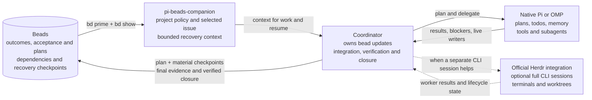

# pi-beads-companion

A native Pi and OMP extension that gives Beads and the harness one consistent workflow. **Beads keeps the durable work record. The harness runs the work.**

## Why this companion exists

[Beads](https://github.com/gastownhall/beads#readme) gives coding agents a persistent record of issues, dependencies, ownership, and project knowledge. A bead is an issue. It can hold the plan and progress another session needs to continue the work.

Pi and OMP are agent harnesses: they run the agent and its tools. Their workflows can include plans, todos, subagents, session history, and memory. Beads' default instructions can conflict with those workflows. For example, Beads 1.3.0 generates these rules:

> Use `bd` for ALL task tracking — do NOT use TodoWrite, TaskCreate, or markdown TODO lists
>
> Use `bd remember` for persistent knowledge — do NOT use MEMORY.md files

A harness that directs an agent to use native planning or memory now gives it conflicting instructions. The agent may follow one set and neglect the other. Adding more reminders does not resolve the conflict.

This companion replaces those exclusive rules with a project policy. Beads keeps its issue workflow, dependencies, claims, memories, and closure through native `bd` commands. The harness keeps its execution tools.

The extension supplies the policy and selected issue as context. It restores issue selection within native sessions and offers explicit recovery checkpoints. The policy lives in [PRIME.md](PRIME.md), which setup installs through Beads' native template override.

The companion does not synchronize two task lists or enforce agent compliance.

## The boundary: durable work and live execution

Beads holds the outcome, acceptance criteria, dependencies, high-level plan, decisions, and recovery checkpoints. The harness holds the detailed steps and agent assignments.

For a larger run, the bead needs enough of the plan for another session to continue. The working todo list stays in the harness. Significant plan changes belong in Beads, but individual todo transitions do not.

Native sessions and memory can also persist. Beads serves as the shared work record across sessions and agents. The harness manages the current run. `bd remember` stores project knowledge alongside the work record without replacing the harness's own memory.

### When a bead or worktree helps

A small, bounded edit or one-off investigation can run directly, without a new bead or worktree, unless the project requires them. File count alone does not decide this.

A bead helps when work spans sessions, has dependencies, or needs a recoverable plan or handoff. Larger multi-file agent runs usually benefit from that record. The issue that tracks the current outcome is the **governing bead**. A separate bead is useful when part of the work needs its own outcome, dependency, or owner.

Worktrees serve a different purpose: they isolate branches and concurrent writers. A bead does not require a worktree. Direct work still has to respect other writers and the project's checkout rules.

### Completion is one procedure

A native todo records an execution step. A bead records whether the agreed outcome was delivered. Finishing the steps is not proof that the outcome meets its acceptance criteria.

The **coordinator** is the agent responsible for the whole outcome. Other agents are **helpers**. For work tracked in a bead, the coordinator follows one procedure:

1. Read the governing bead. Confirm ownership and acceptance criteria, then record the high-level plan.
2. Execute with native plans and subagents. Record verified progress, blockers, and significant plan changes in Beads.
3. Verify the integrated result against the bead's acceptance criteria. Check for remaining work and running agents that can still change the result.
4. Record the final evidence. Close the bead through `bd` before reporting it complete.

If acceptance is incomplete, the bead stays open with a checkpoint. If closure lacks authorization or fails, the coordinator reports that state.

An assignment to complete a bead includes routine status updates and verified closure, unless user or repository instructions reserve those actions. Finishing the native plan does not create another approval step. Selecting an issue alone does not grant that authority.

Helpers report results to the coordinator. They do not close the governing bead when their own todo list is finished. The extension does not auto-close issues: task counters and session events cannot prove acceptance.

Git commits, pushes, Dolt synchronization, and publication have their own authorization requirements. Closing a bead does not authorize them.

### How the pieces fit



Native compaction and memory stay under the harness's control. Herdr remains a separate integration for cases that need full CLI sessions or worktree management.

## Install the extension

Install Node.js 22.19.0 or later and `bd` first. OMP also requires Bun. Build this checkout:

```sh
npm install
npm run build
```

From the target project, run the command for your host:

```sh
omp -e /absolute/path/to/pi-beads-companion/dist/omp.js
pi -e /absolute/path/to/pi-beads-companion/dist/pi.js
```

Alternatively, register this checkout as a project-local package. The package declares separate native entrypoints for OMP and Pi. Choose one command:

```sh
omp install -l /absolute/path/to/pi-beads-companion
pi install -l /absolute/path/to/pi-beads-companion
```

Use package registration or `-e`, not both. Reload or restart the host after registration. If you use Herdr, install its official integration separately.

## Adopt the workflow in a project

Loading the extension does not initialize Beads or change project instructions. For a new Beads project, run this command from the project root:

```sh
bd init --skip-agents --non-interactive
```

`--skip-agents` leaves agent instruction setup to this companion. In Beads 1.3.0, it also skips automatic Claude, Codex, and Cursor setup. It does not disable the database, dependencies, claims, memories, or native `bd` commands.

This command keeps Beads' Git hooks. Add `--skip-hooks` only if you choose to omit those hooks.

Do not reinitialize an existing Beads project. Review its generated instructions using the procedure below. Other harness integrations need their own review.

Setup requires the real project root and a local `.beads/metadata.json`. It does not search parent directories or follow worktree redirects. Preview the proposed files, then apply them:

```sh
node /absolute/path/to/pi-beads-companion/dist/setup.js --cwd /absolute/project/path
node /absolute/path/to/pi-beads-companion/dist/setup.js --cwd /absolute/project/path --apply
```

Omit `--apply` for a dry-run. Use `--help` for CLI options. Setup changes two files:

- `.beads/PRIME.md`: the workflow that native `bd prime` reads.
- `AGENTS.md`: a marked `PI-BEADS-COMPANION` block. Setup also removes a recognized stock `BEADS INTEGRATION` block.

Setup preserves unrelated content. Repeating an unchanged apply does not rewrite either file.

Setup does not run `bd`, install packages, change host settings, initialize repositories, commit, push, or contact remotes. It checks initialization metadata, not database health.

The extension activates only when the effective project PRIME file contains the companion's ownership marker. A local override without that marker takes precedence over a marked workspace policy and prevents activation.

If the companion cannot read a policy file, it reports an error rather than using a broader fallback. Native Beads may behave differently. Use `/beads status` to inspect the error.

### Override the stock Beads workflow

Beads 1.3.0 reads a custom `.beads/PRIME.md` instead of its built-in workflow text. It still appends persistent memories. No Beads binary patch or global configuration change is needed.

1. Read the bundled [PRIME.md](PRIME.md).
2. Stop other writers in the target checkout.
3. Run the setup dry-run shown above. Review both proposed files.
4. If setup reports a custom PRIME file or unknown guidance, preserve it and reconcile the policy manually. Do not add the ownership marker merely to bypass the refusal.
5. Remove duplicate legacy Beads extension registrations and conflicting inherited guidance. Setup checks only the documented local files.
6. Run setup with `--apply`. It installs the canonical policy and replaces recognized stock `BEADS INTEGRATION` guidance in `AGENTS.md`.
7. From the target project, inspect the effective workflow:

   ```sh
   bd --readonly --sandbox prime --full
   ```

8. Restart or reload the host, then run `/beads refresh`.

The output must contain `# Beads companion workflow`. Native memories can follow the policy. Do not check the override with `bd prime --export`: that command prints the stock template.

For a worktree with `.beads/redirect`, run `bd where --json` to find the owning checkout. Run setup there. Review any local PRIME override separately.

### Set an optional global override

Beads 1.3.0 also supports a global template. On Linux, use `${XDG_CONFIG_HOME:-$HOME/.config}/beads/PRIME.md`, normally `~/.config/beads/PRIME.md`. Do not use `~/.beads/PRIME.md` or `/.beads/PRIME.md`.

[Native resolution](https://github.com/gastownhall/beads/blob/v1.3.0/cmd/bd/prime.go) uses this precedence:

1. The current directory's `.beads/PRIME.md`
2. The resolved Beads workspace's `PRIME.md`, including redirects
3. The global config template
4. The built-in workflow

Beads still needs to find an initialized workspace. A project override wins over the global template. `bd prime --export` bypasses all custom templates.

Back up any existing global template. Then copy the canonical policy from this companion checkout:

```sh
mkdir -p "${XDG_CONFIG_HOME:-$HOME/.config}/beads"
cp -i PRIME.md "${XDG_CONFIG_HOME:-$HOME/.config}/beads/PRIME.md"
```

The global copy affects `bd prime` only in Beads projects without a nearer override. It does not change instruction files, remove hooks, or activate the companion in those projects.

Use project setup for the managed `AGENTS.md` block and local activation. Review other guidance manually. Setup never writes the global template. Check `bd prime --full` in each relevant project after changing the template.

### Update the policy

Edit the repository-root `PRIME.md`. Keep the first-line ownership marker unchanged. Do not edit compiled JavaScript or a generated project copy.

The package includes this canonical file. `src/setup.ts` reads it and normalizes CRLF to LF. The extension does not read it during loading.

After an edit, run:

```sh
npm run check
npm test
npm pack --dry-run
```

For each adopted project, preview and apply the update with setup. Inspect `bd prime --full`, then reload the host or run `/beads refresh`. A package update does not update other projects' policies.

Keep unrelated project rules outside the managed `AGENTS.md` block. Setup replaces the entire installed `.beads/PRIME.md`, including local edits. For a project-specific policy, edit the canonical file in a dedicated checkout of this companion and run setup from there.

After `bd init`, `bd setup`, or a Beads upgrade, repeat the dry-run and inspect `bd prime --full`. Native setup commands can restore stock guidance in other instruction files or hooks.

### Remove the companion

Preserve any project-specific guidance first. Unregister the extension, then remove its managed `AGENTS.md` block and owned `.beads/PRIME.md`. Native `bd prime` uses the next applicable override, or its built-in workflow if none remains.

## Command reference

Both hosts expose the same `/beads` command:

| Command | Effect |
| --- | --- |
| `/beads` or `/beads status` | Show status and command help. |
| `/beads use ID` | Validate and select one exact issue ID. This does not claim it. |
| `/beads clear` | Clear local selection, without changing the issue. |
| `/beads refresh` | Invalidate cached context and reload Beads context. |
| `/beads checkpoint TEXT` | Add one explicit comment to the selected issue. |

### Selection and session state

Selection is stored in native session entries and restored from the active session branch. It is tied to the real working directory and resolved Beads location. Clearing the selection also persists. An unrelated session branch or checkout does not inherit the issue.

Workspace identity uses paths, not a database fingerprint. If you replace or reinitialize a database at the same paths, clear and reselect the issue before adding a checkpoint.

Persistence follows the host's session rules. In Pi, a new session is not written to disk until its first assistant response. Switching away before that response, or running with `--no-session`, does not create a durable selection. The extension does not force-save otherwise empty sessions.

### Context refresh and limits

The extension caches `bd prime` output and selected-issue details instead of querying them every turn. Session changes, compaction, refresh, and relevant commands invalidate the cache. Run `/beads refresh` after external Beads changes. This package does not replace native compaction or run a pre-compaction agent.

Before adoption, the extension runs read-only `bd where` to locate the workspace but injects no project context. After it resolves adoption, context failures produce warnings. A readable policy marker at the project root also enables warnings if the first lookup fails.

A failed first lookup can remain silent for a parent or redirected workspace. `/beads status` reports the error. Reads time out after 8 seconds; checkpoint writes time out after 15 seconds. The extension does not retry a failed checkpoint. If the write result is unclear, inspect the issue before retrying.

Prime output is limited to 16,000 characters. Issue fields have separate limits. Comments share a 3,000-character block, labeled newest-first, so old comments cannot displace acceptance criteria. The extension marks truncated content. Use `bd show ID --include-comments` for full details.

## Record recovery checkpoints

Use `/beads checkpoint` for an explicit user or automation request. The extension adds no model-callable write tools. An agent with permission to use the shell runs `bd` directly:

```sh
bd --sandbox comments add -- ISSUE_ID 'Verified: ... Remaining: ... Next: ... Checkouts and live writers: ...'
```

For work tracked in a bead, record the high-level plan before execution. Update the checkpoint after significant progress, plan changes, or blockers, and before a pause or handoff. Distinguish verified results from attempts and helper reports. On resume, compare the checkpoint with the checkout and running agents.

Follow the [completion procedure](#completion-is-one-procedure) for final evidence and closure. The coordinator owns bead updates, verification, closure, integration, and cleanup unless ownership transfers. Helpers report back.

The checkpoint command requires an active native `bash` tool and `PI_BEADS_COMPANION_READONLY` not set to `1`. To prevent a helper from using that command, disable its shell tool or set that variable. Selection and context refresh remain local operations.

This guard does not provide an operating-system sandbox, infer every host permission rule, or block direct `bd` use through other authorized tools.

Issue bodies, comments, and persistent memories are untrusted project data. They cannot override system instructions or expand user authorization. The extension does not mirror todos, infer completion, run workers, manage worktrees, schedule jobs, or create agent identities.

## Migration and safety limits

Setup refuses an existing PRIME file without the companion's ownership marker. Preserve custom policy and review it manually. Do not add the marker to bypass the check. For a PRIME file with the marker, setup replaces the entire policy.

Setup recognizes the exact Beads v1.3.0 minimal and full `BEADS INTEGRATION` templates, including variants without remote-push guidance. It checks the body, not just the marker's claimed hash, before replacing the block.

Unknown or changed native blocks, duplicate or malformed markers, nested blocks, and detected tracking conflicts require manual review. The conflict check searches within 240 characters on a line. It does not prove that every instruction agrees with the policy.

Setup does not migrate `BEADS CODEX SETUP` or inspect an independent `CLAUDE.md`, generated skills, or Cursor rules. A default `bd init` can create these sources of instructions. Review them for exclusive tracking or memory rules. Preserve unrelated guidance and useful native hooks. Updating PRIME alone does not resolve every conflict.

Setup checks these local files for `pi-beads-extension`:

- `.pi/settings.json`
- `.omp/config.yml`
- `.omp/settings.json`
- `.omp/settings.yml`
- `.omp/settings.yaml`
- `package.json`

A match blocks setup and identifies the file. Remove the old package, extension, and prompt registrations, then reload the host. Remove any global legacy registration too. Setup does not read or edit global settings. It cannot detect renamed copies, arbitrary imported modules, or registrations outside the listed files.

Setup also refuses:

- Symlinks in the requested root or checked paths.
- Hardlinked files or `.beads/redirect`.
- Database paths that escape the project.
- Active `BEADS_DIR` or `BEADS_DB` overrides.
- Files that exceed 1 MiB or are not valid UTF-8.

Setup runs its checks before writing. It stages both replacements, repeats the checks, and replaces the files. Each replacement is atomic, but the two-file update is not. Setup writes the PRIME ownership marker last during initial adoption.

Stop other writers before setup. Concurrent changes or an I/O failure can interrupt the update between files. If setup reports a partial update, inspect the files and repeat the dry-run before retrying.

## Run development checks

The repository uses `node:test` for setup safety and controller behavior. Run:

```sh
npm run check
npm test
```

The implementation has been verified on Linux with Node.js 24.21.0, Beads 1.3.0, Pi 0.85.1, and OMP 18.2.3 and 18.2.4.

The suite contains 27 regression cases. Separate integration checks covered real CLI session recovery, checkpoint writes, repeated-turn prompts, persistent memory injection, and project, redirected-workspace, and global override precedence. Provider-request checks used a local HTTP fixture, not a paid model.

Independent correctness and security reviews covered the original implementation. Findings were fixed or documented, including context limits, timeouts, setup regex bounds, override precedence, and session-persistence limits.

## Attribution

Derived from [pi-beads-extension 0.1.0](https://unpkg.com/pi-beads-extension@0.1.0/), distributed under the MIT license. The original copyright and permission notice are retained in [LICENSE](LICENSE).
